  

  
  
  
  
  
  

  
  

 

## ⚡ Current Focus

- **Maveric Systems — AI Intern (Chennai).** LangGraph research agent with MCP tool calls across Tavily, Wikipedia, and arXiv: decomposes a query, runs a multi-step retrieval loop, and writes the synthesis up as a structured document. Second build: a custom agent framework on the Deep Agents SDK with pluggable SKILL.md skills.
- **TENET-AI — SSoC Season 5.** Contributing to defensive middleware in front of LLM endpoints — prompt injection, jailbreak, and data-extraction detection, Redis state, append-only PostgreSQL audit trail, on Kubernetes.
- BTech CSE, VIT Vellore × BS Data Science, IIT Madras (2025–2029).

## 🛠️ Tech Stack

Python · C++ · TypeScript
LangChain · LangGraph · MCP · Deep Agents SDK
FastAPI · Flask · Redis · PostgreSQL · Docker · Kubernetes
scikit-learn · Pandas · NumPy · ChromaDB · Next.js · React · Streamlit

## 🚀 Projects

**[TENET-AI](https://github.com/sarvajithsankar/TENET-AI) — LLM Security Middleware**
FastAPI service that fronts LLM endpoints and inspects every inbound prompt for injection, jailbreak, and data-extraction patterns before the model sees it. Repeated payloads are classified once via Redis; every attempt lands in an append-only PostgreSQL audit trail. Docker, Kubernetes.

**[Sentinel-Vault](https://github.com/sarvajithsankar/Sentinel-Vault) — SIEM in C++17**
Security event monitor with an AVL-tree engine for scored blacklist detection, RAID-1 mirrored vault storage, a FastAPI layer, IsolationForest anomaly analysis, and a React dashboard. `docker-compose up` and it runs.

**[Customer Churn](https://github.com/sarvajithsankar/customer_churn) — Churn Prediction on Imbalanced Data**
Gradient boosting over 7,000+ telecom records, tuned for recall (77%) via threshold moving — missing a churner costs more than a false alarm. EDA plus an interactive simulator for risk parameters.

## 🧠 Learning

- Multi-agent orchestration and memory persistence in LangGraph.
- *Designing Data-Intensive Applications* — the tradeoffs production backends actually make.

## 📬 Contact

- [GitHub — sarvajithsankar](https://github.com/sarvajithsankar)
- [LinkedIn — sarvajithsankar](https://linkedin.com/in/sarvajithsankar)