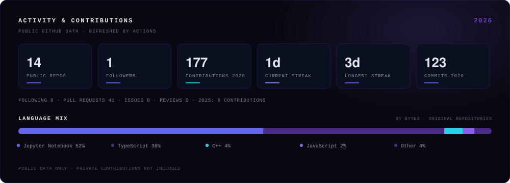
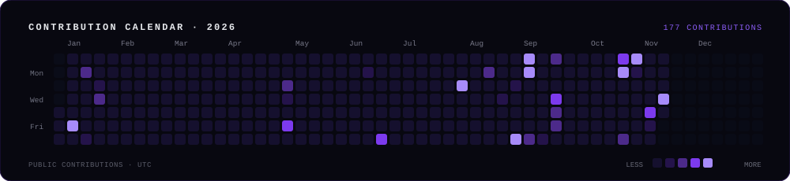

<p align="center">
  
</p>

<p align="center">
  <a href="https://github.com/sarvajithsankar"></a>
  <a href="https://www.linkedin.com/in/sarvajithsankar/"></a>
  <a href="https://sarvajithsankar-github-io.vercel.app/"></a>
  <a href="mailto:sarvajith2knot8@gmail.com"></a>
</p>

<p align="center">
  <sub><b>Currently</b> AI Engineering Intern @ Maveric Systems · Building TENET-AI · VIT Vellore × IIT Madras</sub>
</p>

<p align="center">
  <sub><a href="#01--about">About</a> · <a href="#02--technical-exploration">Exploration</a> · <a href="#03--experience">Experience</a> · <a href="#04--activity--contributions">Activity</a> · <a href="#05--currently-exploring">Exploring</a> · <a href="#06--selected-projects">Projects</a> · <a href="#07--find-me">Contact</a></sub>
</p>

## 01 · About

I'm a Computer Science undergraduate at **VIT Vellore** and a Data Science student at **IIT Madras**. Most of what I know has come from taking systems apart: building a small thing, breaking it, reading the logs, and figuring out why it behaved the way it did.

My interests sit around **AI/ML, LLMs, and agentic systems** — how models are wired into tools, how state and memory persist across steps, and what it takes to make an intelligent application reliable outside a notebook. I'm also spending time on **DevOps and cloud infrastructure**: containers, deployment, CI/CD, and the parts of the stack that decide whether software actually holds up.

I'd rather understand the tradeoffs behind a system than collect certifications, and I'm most useful when I'm building something concrete.

## 02 · Technical exploration

A map of what I'm working with, what I'm learning, and what I'm still figuring out — not a claim of mastery.

**Programming & backend** · <sub>working with</sub><br/>
Python · Java · FastAPI · REST APIs · Git · GitHub

**Machine learning** · <sub>working with</sub><br/>
PyTorch · scikit-learn · Pandas · NumPy · data preprocessing · model evaluation · classification · neural networks

**Generative & agentic AI** · <sub>building with / exploring</sub><br/>
LLMs · transformer architectures · LangChain · LangGraph · Deep Agents SDK · MCP · tool calling · agent workflows · persistent state & memory · prompt engineering · LLM security

**Cloud & DevOps** · <sub>learning</sub><br/>
AWS · Docker · Kubernetes · CI/CD · Linux · containerization · deployment · cloud-native architecture

**Security & systems** · <sub>exploring</sub><br/>
application security · LLM security · prompt injection · API security · security middleware · system monitoring

<p align="center">
  
</p>

## 03 · Experience

> **AI Engineering Intern** · Maveric Systems Limited
>
> <sub>Jun 2026 — Present · Chennai, India</sub>
>
> Working on a LangGraph research agent that decomposes a query, calls tools across Tavily, Wikipedia, and arXiv, runs a multi-step retrieval loop, and writes the findings into a structured document. A second build is a custom agent framework on the **Deep Agents SDK** with pluggable `SKILL.md` skills.
>
> <sub>`LangGraph` `MCP` `Deep Agents SDK` `tool calling` `persistent state`</sub>

<sub>**Education** · BTech CSE, VIT Vellore (2025–2029) · BS Data Science, IIT Madras (2025–2029)</sub>

## 04 · Activity & contributions

<p align="center">
  
</p>

<p align="center">
  
</p>

### Recent public activity

<!-- ACTIVITY:START -->
- **Nov 11** — Pushed to main in [sarvajithsankar](https://github.com/sarvajithsankar/sarvajithsankar)
- **Nov 11** — Pushed to feature/light-theme-portfolio-redesign in [sarvajithsankar.github.io](https://github.com/sarvajithsankar/sarvajithsankar.github.io)
- **Nov 11** — Created branch revert\-4\-design/motion\-dark in [sarvajithsankar](https://github.com/sarvajithsankar/sarvajithsankar)
- **Nov 11** — Merged PR #7 in [sarvajithsankar.github.io](https://github.com/sarvajithsankar/sarvajithsankar.github.io)
- **Nov 11** — Merged PR #5 in [sarvajithsankar](https://github.com/sarvajithsankar/sarvajithsankar)
- **Nov 06** — Pushed to main in [neetcode-submissions](https://github.com/sarvajithsankar/neetcode-submissions)

<sub>Recently updated: [sarvajithsankar.github.io](https://github.com/sarvajithsankar/sarvajithsankar.github.io) · Nov 11 · [neetcode-submissions](https://github.com/sarvajithsankar/neetcode-submissions) · Nov 06 · [TENET-AI](https://github.com/sarvajithsankar/TENET-AI) · Oct 29 · [schema_matching](https://github.com/sarvajithsankar/schema_matching) · Oct 26</sub>
<!-- ACTIVITY:END -->

<details>
<summary><sub>Contribution snake · animated</sub></summary>

<p align="center">
  <picture>
    <source media="(prefers-color-scheme: dark)" srcset="https://raw.githubusercontent.com/sarvajithsankar/sarvajithsankar/output/snake-dark.svg"/>
    <source media="(prefers-color-scheme: light)" srcset="https://raw.githubusercontent.com/sarvajithsankar/sarvajithsankar/output/snake-light.svg"/>
    
  </picture>
</p>

</details>

<p align="center">
  <sub>Refreshed every 12 hours by GitHub Actions · public data only · private contributions require a read-only profile token</sub>
</p>

## 05 · Currently exploring

<sub>The areas I'm actively working through. None of this is finished.</sub>

```text
sarvajith@learning:~$ cat currently_exploring.txt

  agentic-ai/      multi-agent systems · orchestration · LangGraph · Deep Agents
  protocols/       Model Context Protocol · tool calling · persistent memory
  models/          transformer architectures · deep learning · evaluation
  infrastructure/  Docker · Kubernetes · CI/CD · cloud-native deployment
  systems/         scalable backends · monitoring · application security

  mode:    learn → build → break → understand
  status:  in progress
```

## 06 · Selected projects

### [TENET-AI](https://github.com/sarvajithsankar/TENET-AI) <sub>· LLM security middleware</sub>

A defensive middleware layer for LLM applications that inspects inbound prompts for injection, jailbreak, and data-extraction patterns before they reach the model. Contributed during **SSoC Season 5**; the stack uses Redis for repeat classification and an append-only PostgreSQL audit trail, deployed with Docker and Kubernetes.

<sub>`Python` `FastAPI` `Redis` `PostgreSQL` `Docker` `Kubernetes` · [live demo](https://tenet-aiorg.vercel.app)</sub>

### [Sentinel-Vault](https://github.com/sarvajithsankar/Sentinel-Vault) <sub>· SIEM prototype in C++17</sub>

A systems-level security monitor: ingests raw auth logs, rebuilds event chronology with merge sort, scores blacklisted IPs through an AVL-tree threat engine, and mirrors vault state with RAID-1-style persistence.

<sub>`C++17` `AVL trees` `merge sort` `binary I/O` `RAID-1`</sub>

### [Wafer_Anomaly_Detector](https://github.com/sarvajithsankar/Wafer_Anomaly_Detector) <sub>· auditing an ML evaluation</sub>

Reviewed a PyTorch wafer-defect notebook that reported F1 ≥ 0.90, identified the evaluation defects that invalidated the metric, repaired the pipeline, and documented honest results at the natural defect prevalence.

<sub>`Python` `PyTorch` `scikit-learn` `imbalanced-learn` `model evaluation`</sub>

### [Vit-Smart-Assistant](https://github.com/sarvajithsankar/Vit-Smart-Assistant) <sub>· campus assistant</sub>

A Gemini-powered assistant for VIT Vellore students, built with Streamlit. Answers questions about WiFi, library hours, and canteens, and keeps conversational context.

<sub>`Python` `Streamlit` `Google Gemini` · [demo](https://vit-smart-assistant-ypgxzyvtcwwronpclmgzdn.streamlit.app/)</sub>

<sub>Also: [customer_churn](https://github.com/sarvajithsankar/customer_churn) — gradient boosting on 7,000+ telecom records, tuned for recall (77%) via threshold moving.</sub>

## 07 · Find me

<p align="center">
  <a href="https://github.com/sarvajithsankar">GitHub</a> ·
  <a href="https://www.linkedin.com/in/sarvajithsankar/">LinkedIn</a> ·
  <a href="https://sarvajithsankar-github-io.vercel.app/">Portfolio</a> ·
  <a href="mailto:sarvajith2knot8@gmail.com">Email</a>
</p>

<p align="center">
  <sub>Open to internships, open-source collaboration, and conversations about agentic AI and infrastructure.</sub>
</p>

<p align="center">
  
</p>
